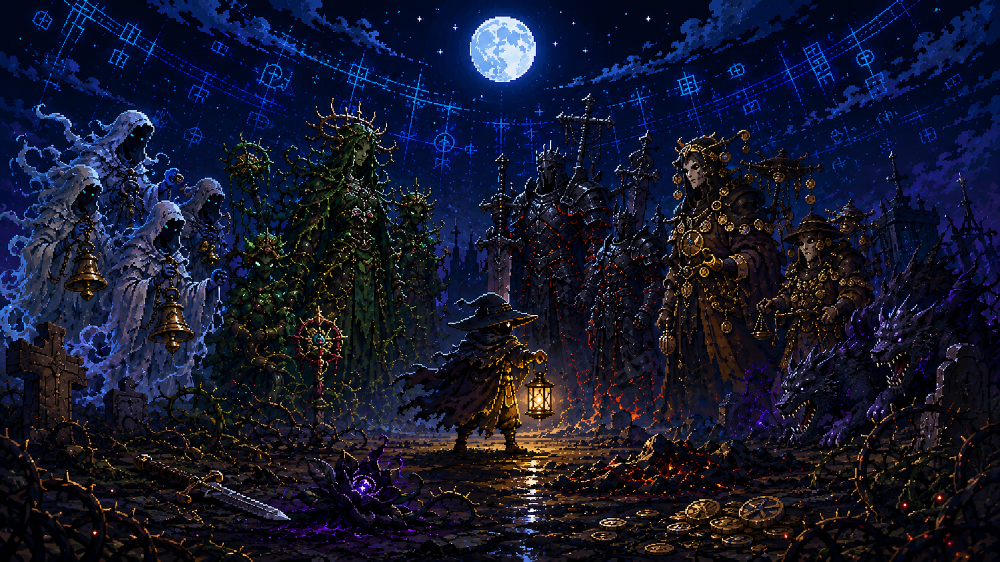
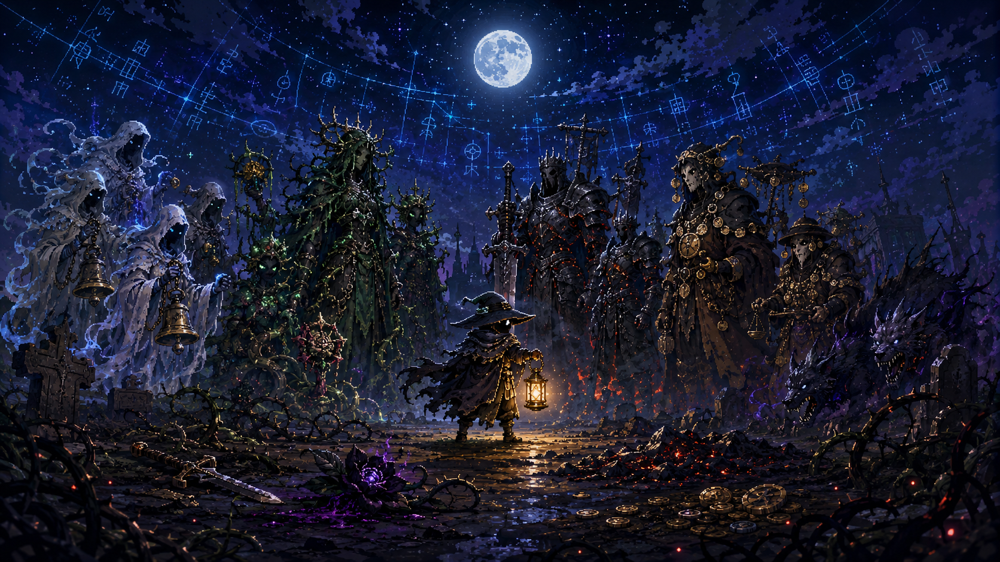

# Mournlight Covenant



**Mournlight Covenant**는 죽은 왕국의 달빛이 플레이어의 승리와 실패를 기록하고, 그 기록이 다음 밤의 오멘과 세력 반응, 보스 의식으로 되돌아오는 모바일 우선 2D 액션 로그라이트입니다.

> **The world remembers how you survive.**  
> 당신이 살아남는 방식이, 다음 밤의 저주가 된다.

## Project Snapshot

| 항목 | 내용 |
|---|---|
| Korean Title | 애도의 서약 |
| Project ID | MLC-001 |
| Repository | `mournlight-covenant` |
| Genre | 2D 탑다운 액션 로그라이트 / 반응형 월드 |
| Primary Platform | Android |
| Secondary Platform | Steam PC |
| Recommended Engine | Godot 4.x |
| Session Length | 5-12분 |
| Business Model | 프리미엄 유료 게임 + 선택형 코스메틱/확장팩 |

## Core Pitch

플레이어는 멸망한 왕국의 마지막 장송관 **Mourn Warden**이 되어 매 밤 저주받은 지역을 정화합니다. 전투는 짧고 즉각적인 액션 로그라이트처럼 진행되지만, 플레이어의 행동은 사라지지 않습니다.

- 독 피해를 자주 쓰면 다음 밤에는 독 저항 오멘이 떠오릅니다.
- 회피를 거의 쓰지 않으면 돌진형 적과 압박 패턴이 늘어납니다.
- 같은 지역에서 반복 사망하면 그곳에 사망 흔적과 추적 의식이 남습니다.
- 특정 세력을 계속 처치하면 그 세력의 원한이 보스 변형 카드로 연결됩니다.

중요한 차별점은 특정 적 NPC가 플레이어를 직접 기억하고 승격하는 구조가 아니라, **세계와 지역과 세력이 플레이어의 전설을 기록하고 왜곡해서 반응한다**는 점입니다.

## Key Visuals

| Docs Hero | Marketing Variant 01 | Marketing Variant 02 |
|---|---|---|
|  |  |  |

이미지는 스토어 상단 배너, GitHub Pages 히어로, Steam 캡슐 초안, 메인 메뉴 무드 보드에 사용할 수 있는 텍스트 없는 16:9 키 비주얼입니다.

## Design Pillars

### 1. Immediate Action Feel

이동, 회피, 기본 공격, 스킬의 리듬을 10초 안에 이해할 수 있어야 합니다. 모바일 피로도를 줄이기 위해 조작은 좌측 이동 스틱과 우측 핵심 버튼 4개 이하로 제한합니다.

### 2. The World Remembers

게임의 장기 반응 시스템은 **World Ledger System**입니다. 플레이어 행동은 `Run Memory`, `Region Ledger`, `Faction Grievance`, `Rumor Deck`, `Ritual Queue`, `Campaign Chronicle` 계층에 기록됩니다.

### 3. Short Runs, Long Campaign

한 판은 5-12분으로 압축하지만, 지역 정화도, 세력 원한, 오멘 카드, 보스 변형, 영구 성장으로 30일 이상 반복 목표를 제공합니다.

### 4. Readable Dark Fantasy

어두운 장송 판타지를 유지하되 모바일 화면에서 캐릭터 실루엣, 공격 예고, 속성 이펙트가 즉시 읽혀야 합니다.

## World Ledger System

World Ledger System은 플레이어의 전투 습관과 실패 기록을 지역/세력/오멘 단위로 축적하고 다음 전투에 반영합니다.

| 기록 태그 | 의미 | 반응 예시 |
|---|---|---|
| `dominant_damage_type` | 특정 속성 피해 비중이 높음 | 해당 속성 저항 오멘 |
| `low_dodge_rate` | 회피 사용률 낮음 | 돌진형 적 증가 |
| `death_hotspot` | 같은 지역 반복 사망 | 묘비 이벤트, 지역 저주 |
| `boss_burst_kill` | 보스 빠른 처치 | 다음 보스 방어 의식 |
| `skill_reliance` | 스킬 피해 의존도 높음 | 침묵 장판 |
| `ignored_rewards` | 보상/상자 무시 | 절제 또는 탐욕 이벤트 |
| `faction_pressure` | 특정 세력 집중 처치 | 세력 원한 증가 |

전투 후에는 반드시 플레이어에게 세계가 무엇을 기억했는지 보여줍니다.

```text
오늘 밤, 달빛은 당신의 독을 기억했습니다.
Thorn Court 원한 +12
Moonless Fen 사망 흔적 +1
새 오멘 후보: 독의 장송가
정화 가능: Memory Wax 3개 사용
```

## Factions

| Faction | Theme | Reaction |
|---|---|---|
| Hollow Choir | 장송 성가대, 망령 | 소리 장판, 공포 디버프 |
| Thorn Court | 가시 귀족, 식물 괴물 | 속박, 출혈, 지형 방해 |
| Ashen Kin | 재의 기사단 | 화염 저항, 돌진병 |
| Pale Market | 죽은 상인들 | 가격 변동, 저주 상품 |
| Moonless Brood | 달 없는 짐승 | 추적자, 시야 제한 |

## Combat Loop

```text
출정 준비
→ 지역 선택
→ 오멘 예고 확인
→ 전투 진입
→ 적 처치 / 경험치 획득
→ 레벨업 선택
→ 중간 이벤트 / 상점 / 성소
→ 엘리트 전투
→ 보스 또는 생존 목표
→ 보상 획득
→ World Ledger 갱신
→ 거점 복귀
```

## Initial Content Target

| Category | Launch Target |
|---|---:|
| Playable Characters | 4 |
| Primary Weapons | 6 |
| Weapon Evolutions | 12 |
| Regions | 5 |
| Bosses | 5 |
| Omen Cards | 45 |
| Relics | 60 |
| Events | 40 |

## Roadmap

| Phase | Duration | Goal |
|---|---:|---|
| Phase 0: Pre-production | 2 weeks | GDD, art bible, combat prototype, risk checklist |
| Phase 1: Vertical Slice | 8 weeks | 1 character, 2 weapons, 1 region, 1 boss, Ledger result screen |
| Phase 2: Alpha | 12 weeks | 3 characters, 4 weapons, 3 regions, save/settings/achievements |
| Phase 3: Beta | 10 weeks | Full launch content, tutorial, screenshots, optimization |
| Phase 4: Launch | 4 weeks | Google Play internal test, Steam page, final tuning |

## Repository Structure

```text
mournlight-covenant/
  README.md
  docs/
    index.html
    GDD.md
    SYSTEM_LEDGER.md
    ART_GUIDE.md
    ROADMAP.md
    KEY_VISUAL_PROMPT.md
    LEGAL_RISK_NOTES.md
  data/
    factions/
    omens/
    regions/
    weapons/
  marketing/
    keyart/
  project/
    godot/
      project.godot
      scenes/
      scripts/
  tools/
    balance_simulator/
    data_validator/
```

## Documentation

- [Game Design Document](docs/GDD.md)
- [World Ledger System](docs/SYSTEM_LEDGER.md)
- [Art Guide](docs/ART_GUIDE.md)
- [Roadmap](docs/ROADMAP.md)
- [Key Visual Prompt](docs/KEY_VISUAL_PROMPT.md)
- [Legal Risk Notes](docs/LEGAL_RISK_NOTES.md)

## GitHub Pages

GitHub Pages용 정적 사이트는 [`docs/index.html`](docs/index.html)에 있습니다. 저장소 설정에서 Pages source를 `main` 브랜치의 `/docs` 폴더로 지정하면 공개 페이지로 사용할 수 있습니다.

## Prototype Quick Start

Godot 4.x에서 `project/godot/project.godot` 파일을 열면 현재 전투 샌드박스와 World Ledger 결과 패널을 확인할 수 있습니다.

```powershell
python tools/data_validator/validate_data.py
```

현재 데이터 검증기는 세력/지역 참조, 오멘 위험도와 저항 상한, 무기 레벨 구조를 확인합니다.

## Legal Note

이 저장소는 게임 기획/프로토타입 기반 자료이며 법률 자문이 아닙니다. 상용 출시 전에는 게임명 상표, 특허 청구항, 외주 애셋 라이선스, 폰트/사운드 라이선스, 개인정보 처리방침을 별도로 검토해야 합니다.
